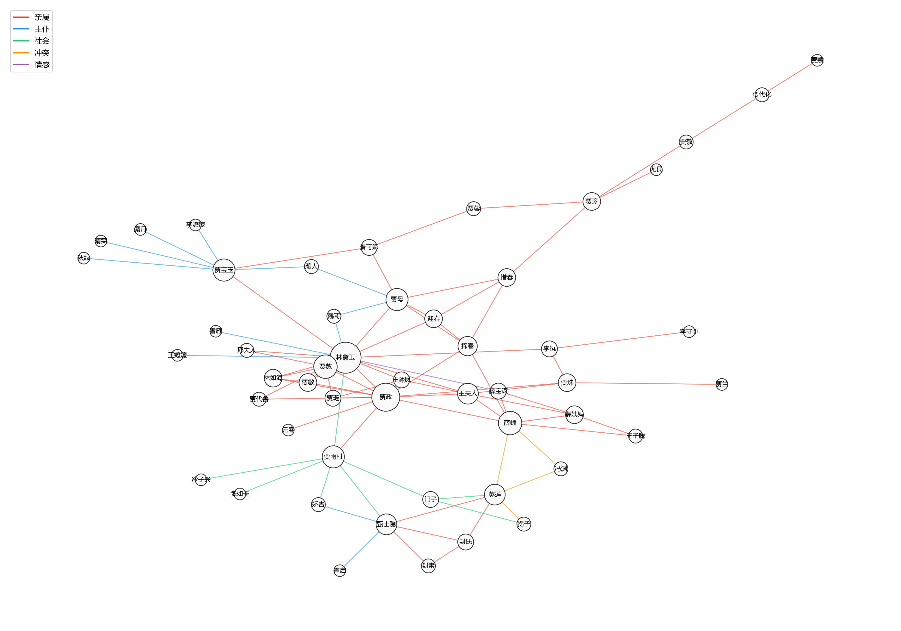

# 红楼梦人物关系分析工具

用大模型 API 自动读取《红楼梦》正文，抽取人物和人物之间的关系，
生成人物表、关系表与关系图谱。

**当前状态**：可跑通前 5 回（作为完整流程的验证）。全 120 回需按同样方式扩展。
> 开发过程、成本与经验总结见 docs/一页说明.md
---

## 一、这个工具能做什么

读入章回体小说的正文，自动产出：

1. **人物表**：出现了哪些人物、各自出场多少次、集中在哪些回目
2. **关系表**：任意两个人之间是什么关系（亲属／主仆／社会／冲突／情感），并附原文依据
3. **关系图谱**：全书人物关系总图，以及任意单个人物的关系网络
4. **关系演变**：同一对人物在不同回目中的关系变化

### 产出示例

**人物表（前 5 行）**：

| 标准名 | 原文中的各种叫法 | 出场总次数 | 分布（回(次数)） |
|---|---|---|---|
| 贾雨村 | 贾雨村、雨村 | 105 | 001(26) 002(40) 003(13) 004(26) |
| 贾宝玉 | 贾宝玉、宝玉 | 92 | 001(1) 002(1) 003(29) 005(61) |
| 林黛玉 | 林黛玉、黛玉 | 86 | 002(2) 003(72) 004(3) 005(9) |
| 贾母 | 贾母 | 40 | 003(32) 004(2) 005(6) |

**关系表（节选）**：

| 人物A | 人物B | 类别 | 出现在第几回 | 原文依据 |
|---|---|---|---|---|
| 林黛玉 | 贾宝玉 | 亲属 | 003 | 宝玉早已看见了一个袅袅婷婷的女儿，便料定是林姑妈之女 |
| 贾宝玉 | 晴雯 | 主仆 | 005 | 只留下袭人、晴雯、麝月、秋纹四个丫鬟为伴 |
| 薛蟠 | 冯渊 | 冲突 | 004 | 因恃强喝令豪奴将冯渊打死 |

**关系图**：



（上图由 `scripts/draw_graph.py` 自动生成）

---

## 二、环境要求

- **Python 3.10 或更高**（本项目在 3.13.15 上开发）
- **一个 DeepSeek API Key**（需要账户有余额，几元钱足够跑完全部流程）
  - 申请地址：https://platform.deepseek.com/api_keys
  - **注意**：网页版会员和 API 是两回事，必须用 API Key

---

## 三、快速开始

### 第 1 步：取得代码

**方式一：下载 ZIP**

打开仓库页面，点绿色的 `Code` 按钮 → `Download ZIP`，
解压后进入解压出来的文件夹。

**方式二：git clone**

```bash
git clone https://github.com/hhggjpg/hlmtool.git
cd hlmtool
```

> 本项目目录名是 `hlmtool`（**中间没有空格**），
> 如果你解压后得到的文件夹名不同，请重命名成 `hlmtool`，
> 否则后面几步的命令要相应修改。

### 第 2 步：创建虚拟环境

**Windows（PowerShell）**：
```powershell
python -m venv .venv
.\.venv\Scripts\Activate.ps1
```

> 如果报错"因为在此系统上禁止运行脚本"，先执行这一条再重试：
> ```powershell
> Set-ExecutionPolicy -ExecutionPolicy RemoteSigned -Scope CurrentUser
> ```

**macOS / Linux**：
```bash
python3 -m venv .venv
source .venv/bin/activate
```

激活成功的标志：命令行最前面出现 `(.venv)`。

### 第 3 步：安装依赖

```bash
python -m pip install -r requirements.txt
```

**网络慢的话**，换国内镜像：
```bash
python -m pip install -r requirements.txt -i https://pypi.tuna.tsinghua.edu.cn/simple
```

### 第 4 步：配置 API Key

复制 `.env.example` 为 `.env`：

```bash
copy .env.example .env        # Windows
cp .env.example .env          # macOS / Linux
```

然后打开 `.env`，把 `your_api_key_here` 换成你自己的 Key：

```
DEEPSEEK_API_KEY=sk-你的真实密钥
```

**注意**：
- 等号两边**不要有空格**，行尾也不要
- `.env` 已被 `.gitignore` 排除，**不会被上传**，可以放心填
- 绝对不要把 Key 直接写进任何 `.py` 文件

### 第 5 步：运行抽取（这一步会花钱，约 ¥1）

```bash
python scripts/extract_all.py
```

**必须在项目根目录运行**（脚本用的是相对路径）。

预计 3～8 分钟，5 回依次处理。产出 `output/chapter_001.json` ~ `chapter_005.json`。

**如果不想花钱**：`output/` 里已包含我跑好的结果，可以直接跳到第 6 步。

> **注意**：仓库里已经包含了跑好的 `output/chapter_00X.json`。
> 脚本会自动跳过已存在的文件（**避免重复花钱**），
> 所以你会先看到 5 行"已存在，跳过"。
>
> **想完整重跑一遍**，先删掉旧结果：
> ```bash
> del output\chapter_0*.json        # Windows
> rm output/chapter_0*.json         # macOS / Linux
> ```
> 然后重新运行 `extract_all.py`。
>
> **想保留旧结果、同时跑新的**：打开 `scripts/extract_all.py`，
> 把 `OUT_SUFFIX = ""` 改成 `OUT_SUFFIX = "_new"`，新结果会存成
> `chapter_001_new.json`，不会覆盖原文件。

### 第 6 步：生成表和图（不花钱）

依次运行：

```bash
python scripts/verify_all.py      # 核对引用，输出准确率
python scripts/make_tables.py     # 生成人物表.csv 和 关系表.csv
python scripts/classify.py        # 关系归类，生成 关系表_分类.csv
python scripts/draw_graph.py      # 生成关系图 PNG
python scripts/changes.py         # 输出关系演变清单
```

全部产出在 `output/` 目录下。

---

## 四、脚本说明

| 脚本 | 作用 | 需要 API | 说明 |
|---|---|---|---|
| `make_clean.py` | 原始文本 → 清洗后文本 | 否 | 本项目的前 5 回无需清洗，此脚本只做"复制 + 逐字核对" |
| `extract_all.py` | 正文 → 人物关系 JSON | **是** | 核心脚本，逐回调用大模型 |
| `verify_all.py` | 核对"原文依据"是否忠实 | 否 | 把模型给的引文拿回原文逐句比对 |
| `make_tables.py` | JSON → 人物表 / 关系表 | 否 | 含别名合并、去重、出场次数统计 |
| `classify.py` | 关系类型收敛为 5 类 | 否 | 把模型自由生成的标签映射到固定类别 |
| `draw_graph.py` | 关系表 → 关系图 | 否 | 输出全图 + 单个主角的关系网（主角可改：修改脚本开头的 `主角 = "林黛玉"`） |
| `changes.py` | 找出关系变化线索 | 否 | 回答"关系随情节怎么变化" |
| `check_names.py` | 人名点名（质检） | 否 | 确认核心人物名字完好无损 |
| `check_outputs.py` | 结构体检（质检） | 否 | 检查 JSON 格式、字段完整性 |
| `scan_pua.py` | 坏字符扫描（质检） | 否 | 找出源文本里的私有区字符 |

**提示词**放在 `prompts/` 目录里，脚本从文件读取，不写在代码里。
版本记录见 `prompts/README.md`。

---

## 五、目录结构

```
hlmtool/
├── README.md
├── requirements.txt
├── .env.example              # 配置模板
├── .gitignore
├── data/
│   ├── raw/                  # 原始文本（5 回）
│   └── clean/                # 清洗后文本（喂给模型的）
├── prompts/                  # 提示词，按版本存档
├── scripts/                  # 全部脚本
├── output/                   # 全部产出
│   ├── chapter_00X.json      # 抽取结果
│   ├── 人物表.csv
│   ├── 关系表.csv
│   ├── 关系表_分类.csv
│   ├── 关系图_全图.png
│   ├── 关系图_林黛玉.png
│   ├── 关系演变清单.txt
│   └── run_log.txt           # 每次运行的 token 用量
├── docs/
│   └── 数据问题清单.md        # 数据质量记录 + 清洗决定
└── examples/
    └── hello_api.py          # 最小 API 调用示例
```

---

## 六、数据来源

- 文本：纯文学网站（purepen.com）《红楼梦》程高本
  - 该站 `robots.txt` 允许抓取
  - 正文已是简体中文，无需繁简转换
- **纪律：整个项目只用这一个来源**，不与维基文库等其他版本混用
  （不同版本的回目名、用字都有差异，混用会导致人物名对不上）

---

## 七、成本

前 5 回实测：

| 项目 | 数值 |
|---|---|
| 输入 token | 28,116 |
| 输出 token | 111,511 |
| 合计 | 139,627 |
| 估算费用 | 约 ¥0.5 – 1（实际以平台账单为准） |

（按 DeepSeek Flash 模型计价：输入 $0.15/百万、输出 $0.6/百万，低谷时段）

**输出 token 是输入的 4 倍**——因为模型默认开启"思考模式"，
大部分输出是内部推理过程，不是结果本身。跑全书 120 回时，
考虑关闭或降低思考强度以节省成本。

全书 120 回外推：约 ¥12 – 25。

---

## 八、已知局限（重要）

1. **仅处理前 5 回**。全 120 回需按同样流程扩展。

2. **别名合并不完整**。同一人物在不同回目可能有不同写法
   （如"贾雨村／雨村"），别名字典为手工维护，未覆盖全部情况。

3. **隐含关系缺失**。提示词要求"只抽原文明确写到的关系"，
   因此前五回中并未直接写明的祖孙关系（如贾母—贾宝玉）未能抽出。
   这是**精度与召回的取舍**：严格规则能防止编造，但会漏掉隐含关系。

4. **无法表达关系方向**。如"黛玉对宝钗有些不忿，宝钗却浑然不觉"，
   这种单向关系当前数据结构无法体现。

5. **关系判断未经人工全面核验**。已核验的是"引用是否忠实原文"
   （99.2%），**不代表关系判断本身全部正确**。

6. **源文本存在 14 处生僻字缺失**（私有区字符），均为描写性文字，
   不涉及人物姓名，未作修正。详见 `docs/数据问题清单.md`。

---

## 九、如何验证结果是否可靠

**可复现的含义**：大模型的输出带有随机性，同一条提示词跑两次结果不会逐字相同。
本项目保证的是**流程可复现**——相同的输入、提示词和参数，能得到结构一致、
质量相当的结果。

**结果的质量由脚本检验，而不是靠肉眼**：

```bash
python scripts/verify_all.py
```

它做的是：把模型给出的每一条"原文依据"拿回原文里逐句比对，
统计有多少条真正忠实于原文。**这是与模型随机性无关的检验。**

当前结果（基于前 5 回）：123 条引用中 122 条可在原文中找到，**忠实度 99.2%**。
唯一 1 条为"裁剪拼接"型错误（详见 `docs/数据问题清单.md`）。

---

## 十、遇到问题

| 现象 | 原因 | 解决 |
|---|---|---|
| `python 不是内部或外部命令` | 虚拟环境没激活 | 先执行 `.\.venv\Scripts\Activate.ps1` |
| `ModuleNotFoundError` | 依赖没装 | `python -m pip install -r requirements.txt` |
| `401 Authentication Fails` | Key 没读到或写错 | 检查 `.env` 的变量名和空格 |
| `402 Insufficient Balance` | 账户余额不足 | 去平台充值 |
| 提示"禁止运行脚本" | PowerShell 执行策略 | `Set-ExecutionPolicy -ExecutionPolicy RemoteSigned -Scope CurrentUser` |
| 图里中文显示成方框 | 系统缺中文字体 | 修改 `draw_graph.py` 里的 `font.sans-serif` 为你系统里有的一种中文字体 |

---

## 十一、开发过程

- **模型**：DeepSeek `deepseek-flash`（实际对应 DeepSeek-V4.1-Flash）
- **为什么选它**：中文原生、价格低、接口兼容 OpenAI 格式（换厂商只改两行）、
  文档是中文的
- **提示词迭代**：共 3 版，记录见 `prompts/README.md`
- **数据质量记录**：见 `docs/数据问题清单.md`
