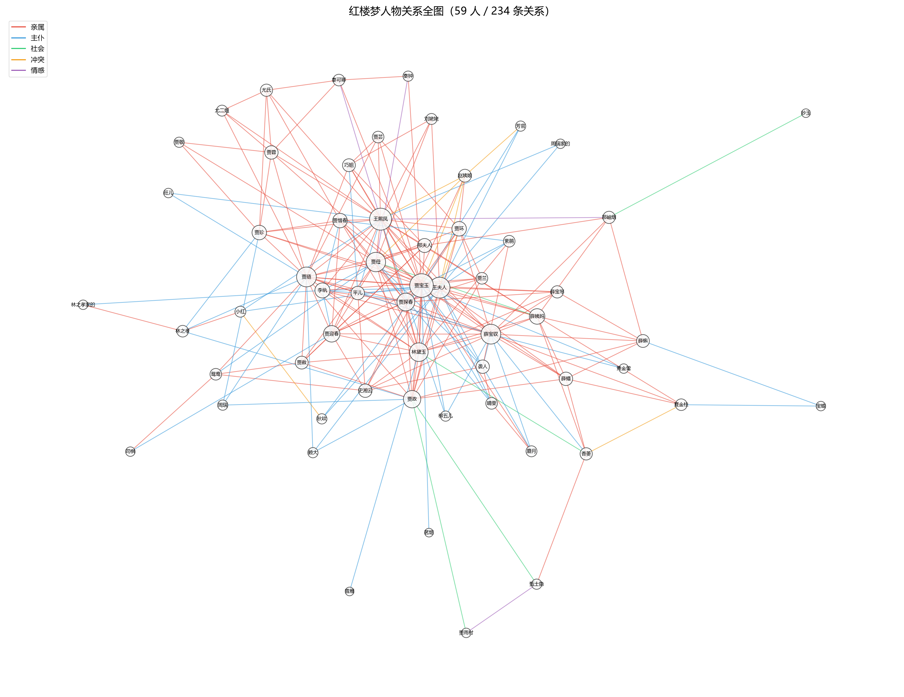
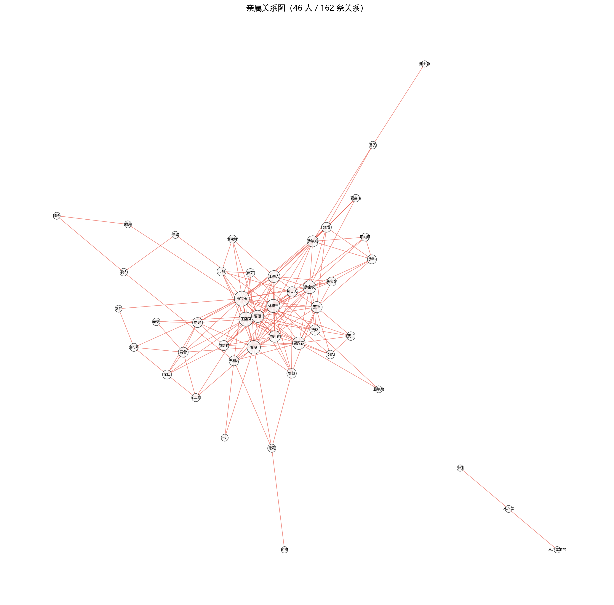
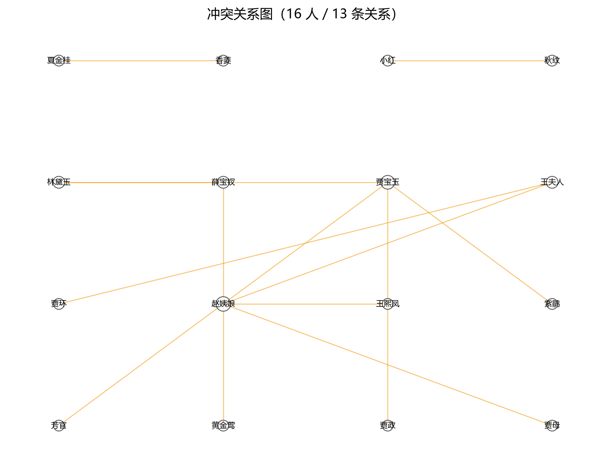

# 红楼梦人物关系分析工具

用大模型 API 自动读取《红楼梦》全 120 回正文，抽取人物和人物之间的关系，
生成人物表、关系表与关系图谱。

**当前状态**：✅ **已跑通全 120 回**（程高本，约 73 万字）。
共抽出 497 个人物、2022 条关系，原文依据忠实度 **99.3%**，
**全本一次运行花费 ¥14.88**（平台账单，详见第七章）。

> 开发过程、成本与经验总结见 docs/一页说明.md
> 数据质量记录与踩坑记录见 docs/数据问题清单.md
---

## 一、这个工具能做什么

读入章回体小说的正文，自动产出：

1. **人物表**：出现了哪些人物、各自出场多少次、集中在哪些回目
2. **关系表**：任意两个人之间是什么关系（亲属／主仆／社会／冲突／情感），并附原文依据
3. **关系图谱**：全书人物关系总图，以及任意单个人物的关系网络
4. **关系演变**：同一对人物在不同回目中的关系变化

### 产出示例

**人物表（前 10 名）**：

| 标准名 | 原文中的各种叫法 | 出场总次数 |
|---|---|---|
| 贾宝玉 | 贾宝玉、宝玉、宝二爷、怡红公子、绛洞花王、无事忙 | 4498 |
| 贾母 | 贾母、老太太、史太君、老祖宗、太君 | 2752 |
| 王熙凤 | 王熙凤、凤姐、凤姐儿、凤丫头、琏二奶奶、凤辣子 | 2051 |
| 林黛玉 | 林黛玉、黛玉、林姑娘、林妹妹、颦儿、潇湘妃子 | 1632 |
| 薛宝钗 | 薛宝钗、宝钗、宝姐姐、宝姑娘、蘅芜君 | 1227 |
| 袭人 | 袭人、花袭人、蕊珠 | 1148 |
| 王夫人 | 王夫人 | 1071 |
| 贾政 | 贾政、政、政老爷、二老爷 | 999 |
| 贾琏 | 贾琏、琏、琏二爷 | 890 |
| 平儿 | 平儿、平姑娘 | 717 |

> **注意"各种叫法"这一列**：模型在 120 回里对同一个人用了很多种称呼
> （宝玉还叫"宝二爷""怡红公子"，贾母还叫"老太太""老祖宗"）。
> 把这些合并成一个人，是 `make_tables.py` 里 `ALIAS` 字典的功劳。

**关系表（节选）**：

| 人物A | 人物B | 关系类型 | 回目 | 原文依据 |
|---|---|---|---|---|
| 林黛玉 | 贾宝玉 | 亲属 | 003 | 宝玉早已看见了一个袅袅婷婷的女儿，便料定是林姑妈之女 |
| 贾宝玉 | 晴雯 | 主仆 | 005 | 只留下袭人、晴雯、麝月、秋纹四个丫鬟为伴 |
| 薛蟠 | 冯渊 | 冲突 | 004 | 因恃强喝令豪奴将冯渊打死 |
| 丰儿 | 王熙凤 | 主仆 | 029 | 凤姐儿的丫头平儿、丰儿、小红 |

**关系图**：



（上图由 `scripts/draw_graph.py` 自动生成，只画出场次数最多的前 60 人——
全画上去有 400 多个节点，中心会糊成一团。这个阈值可以在脚本开头的 `TOP_N` 改。）

**光看全图会觉得"线太密、看不清"，所以还按关系类别拆成了 5 张**：

| 图 | 内容 |
|---|---|
| `关系图_亲属.png` | 46 人 / 162 条关系 |
| `关系图_主仆.png` | 40 人 / 65 条关系 |
| `关系图_社会.png` | 13 人 / 8 条关系 |
| `关系图_冲突.png` | 16 人 / 13 条关系 |
| `关系图_情感.png` | 16 人 / 16 条关系 |

> **为什么要拆**：全图 234 条边里有 162 条（69%）都是亲属关系，
> 把主仆/情感/冲突全盖住了。拆开之后，亲属图虽然还是密，
> 但密的都是同一种关系（家族谱系）；而冲突图只有 13 条边——
> **正因为空，反而一眼就能看清谁跟谁有仇**。




**关系演变**（`关系演变清单.txt` 节选）：

```
贾宝玉 — 林黛玉
    003,116 | 亲属 / 表兄妹
        宝玉早已看见了一个袅袅婷婷的女儿，便料定是林姑妈之女 ...
    008 | 亲属 / 兄妹（称呼林妹妹）
        ...
```

> 这份清单列出**同一对人物出现多条记录**或**跨多回出现**的配对，共 192 对、1198 行。
> 它回答任务书里的第三类问题："某个人的关系网络**随情节怎么变化**"。

---

## 一·五、想查谁就查谁（交互查询）

不想改代码换主角？用 `scripts/query.py`：

```bash
python scripts/query.py
```

运行后会列出菜单：

```
  [1] 看某个人物的关系网图      例如：贾宝玉
  [2] 看某个人物的关系演变       例如：贾宝玉
  [3] 看某个人物的全部关系记录   按类别分组列出
  [4] 重新生成全部预设图（全图 + 5 张分类图）
  [5] 列出出场次数最多的人物
  [0] 退出
```

也可以直接带参数（适合熟练使用或写进批处理）：

```bash
python scripts/query.py 贾宝玉          # 出他的关系网图
python scripts/query.py 宝玉            # 支持模糊匹配，自动认成"贾宝玉"
python scripts/query.py 黛玉 演变        # 看她的关系随回目怎么变
python scripts/query.py 贾宝玉 全部关系   # 按类别列出他的所有关系
python scripts/query.py 全部            # 重新生成全部预设图
```

**注意"模糊匹配"的规则**：输"宝玉"会匹配到 贾宝玉／甄宝玉／宝玉的奶母三个人，
程序**按出场次数**自动选了贾宝玉（4498 次，另两个只有 36 次和 2 次），并会告诉你它选了谁。
如果两个候选都很重要（比如输"贾"，匹配到十几个贾家人），它不会瞎猜，而是把候选列出来让你写清楚。

> **为什么不支持"说人话"的自然语言查询**（比如"我想看宝玉跟谁走得近"）？
> 那需要再调用一次大模型来"猜你想干什么"，而这会破坏本项目最重要的一条设计：
> **全项目只有 `extract_all.py` 一个地方调用大模型**——这句话保证了便宜（跑完全本 ¥14.88）
> 和可复现（结果存在硬盘上，跑多少遍都一样）。
> 菜单式查询的体验已经够用，而且**零成本、结果固定**。

---

## 二、环境要求

- **Python 3.10 或更高**（本项目在 3.13.15 上开发）
- **一个 DeepSeek API Key**（需要账户有余额，几元钱足够跑完全部流程）
  - 申请地址：https://platform.deepseek.com/api_keys
  - **注意**：网页版会员和 API 是两回事，必须用 API Key

---

## 三、快速开始

### 第 1 步：取得代码

**方式一：下载 ZIP**

打开仓库页面，点绿色的 `Code` 按钮 → `Download ZIP`，
解压后进入解压出来的文件夹。

**方式二：git clone**

```bash
git clone [你的仓库地址]
cd hlmtool
```

> 本项目目录名是 `hlmtool`（**中间没有空格**），
> 如果你解压后得到的文件夹名不同，请重命名成 `hlmtool`，
> 否则后面几步的命令要相应修改。

### 第 2 步：创建虚拟环境

**Windows（PowerShell）**：
```powershell
python -m venv .venv
.\.venv\Scripts\Activate.ps1
```

> 如果报错"因为在此系统上禁止运行脚本"，先执行这一条再重试：
> ```powershell
> Set-ExecutionPolicy -ExecutionPolicy RemoteSigned -Scope CurrentUser
> ```

**macOS / Linux**：
```bash
python3 -m venv .venv
source .venv/bin/activate
```

激活成功的标志：命令行最前面出现 `(.venv)`。

### 第 3 步：安装依赖

```bash
python -m pip install -r requirements.txt
```

**网络慢的话**，换国内镜像：
```bash
python -m pip install -r requirements.txt -i https://pypi.tuna.tsinghua.edu.cn/simple
```

### 第 4 步：配置 API Key

复制 `.env.example` 为 `.env`：

```bash
copy .env.example .env        # Windows
cp .env.example .env          # macOS / Linux
```

然后打开 `.env`，把 `your_api_key_here` 换成你自己的 Key：

```
DEEPSEEK_API_KEY=sk-你的真实密钥
```

**注意**：
- 等号两边**不要有空格**，行尾也不要
- `.env` 已被 `.gitignore` 排除，**不会被上传**，可以放心填
- 绝对不要把 Key 直接写进任何 `.py` 文件

### 第 5 步：取得《红楼梦》全文（不花钱）

```bash
python scripts/fetch_text.py
```

会从公开仓库把程高本 120 回抓下来，存成 `data/raw/001.txt` ~ `120.txt`，约 2.5 MB。

- **已存在的文件会自动跳过**（所以中断后重跑不会浪费）
- 只想抓某一回：`python scripts/fetch_text.py 001`
- **仓库里已包含抓好的全文**，所以这一步通常会看到 120 行"已存在，跳过"

然后把它复制进 `data/clean/`（本项目不做额外清洗，只做"复制 + 逐字核对"）：

```bash
python scripts/make_clean.py
```

### 第 6 步：运行抽取（这一步会花钱，全本约 ¥15）

```bash
python scripts/extract_all.py
```

**必须在项目根目录运行**（脚本用的是相对路径）。

全 120 回预计 **2～4 小时**（每回一次请求，每次 1～2 分钟）。

> **注意**：仓库里已经包含了跑好的 `output/chapter_001.json` ~ `chapter_120.json`。
> 脚本会自动跳过已存在的文件（**避免重复花钱**），
> 所以你会先看到 120 行"已存在，跳过"。
>
> **想完整重跑一遍**，先删掉旧结果：
> ```bash
> del output\chapter_*.json        # Windows
> rm output/chapter_*.json         # macOS / Linux
> ```
>
> **想保留旧结果、同时跑新的**：把 `scripts/extract_all.py` 里的
> `OUT_SUFFIX = ""` 改成 `OUT_SUFFIX = "_new"`，新结果会存成
> `chapter_001_new.json`，不会覆盖原文件。

### 第 7 步：生成表和图（不花钱）

依次运行：

```bash
python scripts/verify_all.py      # 核对引用，输出准确率
python scripts/make_tables.py     # 生成人物表.csv 和 关系表.csv
python scripts/classify.py        # 关系归类，生成 关系表_分类.csv
python scripts/draw_graph.py      # 生成关系图 PNG（全图 + 5 张分类图 + 主角图）
python scripts/changes.py         # 生成 关系演变清单.txt
```

全部产出在 `output/` 目录下。

**装完之后想查点什么**，用这个（不用改代码）：

```bash
python scripts/query.py           # 交互菜单
python scripts/query.py 贾宝玉     # 直接出他的关系网图
```

---

## 四、脚本说明

| 脚本 | 作用 | 需要 API | 说明 |
|---|---|---|---|
| `fetch_text.py` | 下载全文 → `data/raw/` | 否 | 从公开仓库抓程高本 120 回 |
| `make_clean.py` | 原始文本 → 清洗后文本 | 否 | 本项目不做额外清洗，只做"复制 + 逐字核对" |
| `extract_all.py` | 正文 → 人物关系 JSON | **是** | **全项目唯一调用大模型的地方**，逐回处理 |
| `verify_all.py` | 核对"原文依据"是否忠实 | 否 | 把模型给的引文拿回原文逐句比对 |
| `make_tables.py` | JSON → 人物表 / 关系表 | 否 | 含别名合并（200+ 条）、去重、出场次数统计 |
| `classify.py` | 关系类型收敛为 5 类 | 否 | 用**关键词归类**（不是逐字匹配），能覆盖上百种自由标签 |
| `draw_graph.py` | 关系表 → 关系图 | 否 | 输出全图 + **按类别拆分的 5 张图** + 主角示例图；`TOP_N` 控制画多少人 |
| `query.py` | **交互查询** | 否 | 输入人名就能看他的关系网图／关系演变／全部关系记录。**不调用大模型**，零成本 |
| `changes.py` | 找出关系变化线索 | 否 | 回答"关系随情节怎么变化"，输出 `关系演变清单.txt` |
| `fix_085.py` | 修补第 85 回 | **是** | 整回会让模型"复读失控"，此脚本切两段抽再合并（见 docs/数据问题清单.md） |
| `check_names.py` | 人名点名（质检） | 否 | 确认核心人物名字完好无损 |
| `check_outputs.py` | 结构体检（质检） | 否 | 检查 JSON 格式、字段完整性 |
| `scan_pua.py` | 坏字符扫描（质检） | 否 | 找出源文本里的私有区字符 |

**提示词**放在 `prompts/` 目录里，脚本从文件读取，不写在代码里。
版本记录见 `prompts/README.md`。

---

## 五、目录结构

```
hlmtool/
├── README.md
├── requirements.txt
├── .env.example              # 配置模板
├── .gitignore
├── data/
│   ├── raw/                  # 原始文本（120 回，2.5 MB）
│   ├── clean/                # 清洗后文本（喂给模型的）
│   └── raw_backup_manual/    # 最早手工复制的 5 回（留作对照，未使用）
├── prompts/                  # 提示词，按版本存档
├── scripts/                  # 全部脚本
├── output/                   # 全部产出
│   ├── chapter_001.json ~ chapter_120.json   # 每回的抽取结果
│   ├── 人物表.csv            # 497 人
│   ├── 关系表.csv            # 2022 条关系
│   ├── 关系表_分类.csv        # 加上五大类归类
│   ├── 关系图_全图.png         # 59 人 / 234 条关系
│   ├── 关系图_亲属.png         # 46 人 / 162 条关系（按类别拆分）
│   ├── 关系图_主仆.png         # 40 人 / 65 条关系
│   ├── 关系图_社会.png         # 13 人 / 8 条关系
│   ├── 关系图_冲突.png         # 16 人 / 13 条关系
│   ├── 关系图_情感.png         # 16 人 / 16 条关系
│   ├── 关系图_林黛玉.png        # 单人关系网示例
│   ├── 关系演变清单.txt       # 192 对人物有跨回变化
│   ├── run_log.txt           # 每次运行的 token 用量
│   └── archive_v1_5chapters/ # 最早的 5 回版结果（留作对照）
├── docs/
│   ├── 一页说明.md            # 模型选择 / 成本 / 卡点 / 复盘
│   ├── 数据问题清单.md        # 数据质量记录 + 踩坑记录
│   ├── Python概念清单.md      # 学习笔记（复习提纲）
│   └── Python词汇表.md        # 学习笔记（术语表）
└── examples/
    └── hello_api.py          # 最小 API 调用示例
```

---

## 六、数据来源

- **正文**：《红楼梦》程高本（一百二十回），公有领域
  - 取自公开仓库 [gitbook-hongloumeng](https://github.com/AnLittleHong/gitbook-hongloumeng) 的 `ch_cgb/` 目录
  - 该目录按回分成 `001.md` ~ `120.md`，本项目用 `scripts/fetch_text.py` 抓取并清洗成纯文本
  - 已用 `scripts/scan_pua.py` 扫描：**120 回均无私有区坏字符**
- **纪律：整个项目只用这一个来源**
  - 不同版本（程高本 / 脂评本）的回目名和用字都有差异，混用会导致人物名对不上
  - 本项目最初手工复制过 5 回（来自另一个网页版本），后来发现与程高本差异较大
    （去空白后相似度仅 78.9%），已**全部弃用并改用统一来源**，
    旧文件保留在 `data/raw_backup_manual/` 作对照

---

## 七、成本（全 120 回实测）

### 7.1 实际花了多少：¥14.88

平台账单（"10/04–10/05"区间，`python` 这个 Key 的支出，即本项目脚本的开销）：

| 日期 | `python`（本项目） | DSH（开发工具） |
|---|---|---|
| 10/04 | **¥14.15** | ¥0.81 |
| 10/05 | **¥0.73** | ¥0.48 |
| **合计** | **¥14.88** | ¥1.29 |

- 区间合计：**¥16.19**，其中本项目占 **¥14.88**
- 预算 1000 元，实际用了约 **1.5%**
- 账号近 30 天累计为 ¥37.72 / 375,198,165 tokens，
  但那包含本项目、开发工具、前期 5 回版试跑和各类测试，**不是本项目的开销**

### 7.2 单价与 token

`deepseek-flash` 官网现行价（<https://api-docs.deepseek.com/zh-cn/quick_start/pricing>）：

| | 空闲时段 | 高峰时段 |
|---|---|---|
| 输入（缓存命中） | ¥0.02 / 百万 | ¥0.04 / 百万 |
| 输入（缓存未命中） | ¥1 / 百万 | ¥2 / 百万 |
| 输出 | ¥4 / 百万 | ¥8 / 百万 |

周一至周五 9:00–12:00、14:00–18:00 为高峰，其余时间（含周末全天）为空闲，
**空闲价是高峰价的一半**。本项目全程跑在空闲时段。

脚本记录的 token（`output/run_log.txt`，来自每次 API 返回的 `usage` 字段）：

| 项目 | 数值 |
|---|---|
| 输入 token | 676,039 |
| 输出 token | 3,170,013 |
| 合计 | **3,846,052** |

> **两套 token 数字口径不同，不要混着引用**：`run_log` 的 384 万是脚本能看到的部分；
> 平台账单同期记的是 3,829 万（含模型思考过程的完整计量）。
> **报账以账单金额为准。**

**几个观察**：

1. **输出 token 是输入的 4.7 倍**。因为每条关系都要附一句"原文依据"，
   抽出来的内容比原文还长。这是最主要的成本来源。
2. **单回波动很大**：最短的一回只输出 1.2 万 token，最长的一回输出 6.5 万
   （就是第 85 回"复读失控"那次，详见"已知局限"）。
3. 预算 1000 元，实际用了不到 2%。**算下来整本书跑一遍不到一杯奶茶钱**——
   所以"多试错几次"的成本压力几乎不存在。

---

## 八、已知局限（重要）

1. **别名合并不完整**。ALIAS 字典是手工维护的（已扩到 200+ 条，
   覆盖了主要人物），但 497 个人物里仍有长尾未合并的情况。

2. **关系标签过于自由**。模型生成了 **1007 种**不同的关系标签
   （"吩咐""命取杯""称谓：姐姐"……）。`classify.py` 用关键词规则能归掉约 60%，
   **仍有约 812 条（40%）归不进五大类**，这些边不画进图。

3. **部分回目抽取偏少**。对照发现：第 28 回抽出 59 条关系，第 44 回只有 7 条
   （两回人物数量接近）。**可能是模型那几次"偷懒"了**，未逐回重跑修正。

4. **隐含关系缺失**。提示词要求"只抽原文明确写到的关系"，
   未直接写明的祖孙关系（如贾母—贾宝玉）依赖模型从上下文推断，不稳定。
   这是**精度与召回的取舍**：严格规则能防止编造，但会漏掉隐含关系。

5. **无法表达关系方向**。如"黛玉对宝钗有些不忿，宝钗却浑然不觉"，
   这种单向关系当前数据结构（无向图）无法体现。

6. **关系判断未经人工全面核验**。已核验的是"引用是否忠实原文"（**99.3%**），
   **不代表关系判断本身全部正确**。

7. **第 85 回是用切分法补的**。整回发给模型会让它陷入"复读"，
   输出到 65536 token 上限被截断、返回空内容。现用 `fix_085.py`
   切成两段分别抽取再合并，**该回结果的质量与其它回不完全一致**。

---

## 九、如何验证结果是否可靠

**可复现的含义**：大模型的输出带有随机性，同一条提示词跑两次结果不会逐字相同。
本项目保证的是**流程可复现**——相同的输入、提示词和参数，能得到结构一致、
质量相当的结果。

**结果的质量由脚本检验，而不是靠肉眼**：

```bash
python scripts/verify_all.py
```

它做的是：把模型给出的每一条"原文依据"拿回原文里逐句比对，
统计有多少条真正忠实于原文。**这是与模型随机性无关的检验。**

**当前结果（全 120 回）**：2597 条引用中 2579 条可在原文中找到，
**忠实度 99.3%**。18 条未找到，多为"裁剪拼接"型错误或跨句拼合。

另外三个质检脚本：

```bash
python scripts/check_outputs.py   # JSON 结构与字段完整性
python scripts/scan_pua.py        # 源文本里的私有区坏字符
python scripts/check_names.py     # 核心人物名字是否完好
```

---

## 十、遇到问题

| 现象 | 原因 | 解决 |
|---|---|---|
| `python 不是内部或外部命令` | 虚拟环境没激活 | 先执行 `.\.venv\Scripts\Activate.ps1` |
| `ModuleNotFoundError` | 依赖没装 | `python -m pip install -r requirements.txt` |
| `401 Authentication Fails` | Key 没读到或写错 | 检查 `.env` 的变量名和空格 |
| `402 Insufficient Balance` | 账户余额不足 | 去平台充值 |
| 提示"禁止运行脚本" | PowerShell 执行策略 | `Set-ExecutionPolicy -ExecutionPolicy RemoteSigned -Scope CurrentUser` |
| 图里中文显示成方框 | 系统缺中文字体 | 修改 `draw_graph.py` 里的 `font.sans-serif` 为你系统里有的一种中文字体 |

---

## 十一、开发过程

- **模型**：DeepSeek `deepseek-flash`（实际对应 DeepSeek-V4.1-Flash）
- **为什么选它**：中文原生、价格低、接口兼容 OpenAI 格式（换厂商只改两行）、
  文档是中文的
- **提示词迭代**：共 3 版，记录见 `prompts/README.md`
- **数据质量记录**：见 `docs/数据问题清单.md`